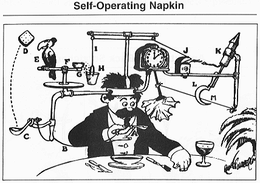

class: center middle inverse

## "It works on my machine."

???

- This statement actively made my hair stand on end when I joined RV two years ago
- Critical ML systems in R had limited redundancy, a few data science laptops
- Difficult to recreate the errors in production systems on AWS
- Collaborating on these application required a multi-day slog against rJava...
- Project setup was a multi-day task,

My Goal

- Fast setup for new teammates, 20 minutes or less
- Consistent environments between local, development, staging, and production
- Clear articulation of system and packages dependencies

---

## Challenges Making R Reproducible

.pull-left[
.large[
Problem Area

- Machine/OS

- R Installation

- Package Versions
]]

.pull-right[
.large[
Tool(s)

- [Docker](https://www.docker.com/)

- [rocker](https://www.rocker-project.org/)

- [renv](https://github.com/rstudio/renv)
]]

???

- High level buckets of problems we experienced managing R in production
- Over the next few slides, we are going to slowly build into to creating a more reproducible environment with these tools.

---
## Docker: Blueprints for Reproducible Computing


Check out an example [here](https://hub.docker.com/r/rocker/rstudio/dockerfile).

???

Multiple bits of terminology to consider; 

- Dockerfile - recipe for creating Docker images
- Images - image gets built by running a Docker command (which uses that Dockerfile)
- Containers - a running instance of a Docker image.

Primary take-away; Docker builds pre-defined computers in a repeatable way.

---
## rocker: RStudio on Docker

```shell
$ docker run --rm \
         -e PASSWORD=<your-password> \
         -p 8787:8787 \
         rocker/rstudio
```

.footnote[<hr>
With [Docker](https://docs.docker.com/install/) installed, run the command above and navigate to  <http://localhost:8787/> in any browser. Press `ctrl` + `C` in the terminal to stop the container.
]

???

What is going on here?

1. Taking the image `rocker/rstudio` defined by the rocker-project
2. Creating and running a container that matches that image
3. Injecting a password and port
4. `--rm` cleans up the container when we exit

---
## rocker: Locking in a R Version

```shell
$ docker run --rm \
         -e PASSWORD=<your-password> \
         -p 8787:8787 \
         rocker/rstudio:3.6.2
```

.footnote[<hr>
The [rocker-project](https://www.rocker-project.org/images/) provides some images that accept a version tag specifying which version of R is desired, e.g. `rocker/rstudio:3.6.2` for R `3.6.2`.
]

---
## Docker Volumes: Sharing File systems with a Container

```shell
$ docker run --rm \
         -e PASSWORD=<your-password> \
         -p 8787:8787 \
         -v ~/Documents:/home/rstudio/Documents \
         rocker/rstudio:3.6.2
```

.footnote[<hr>
In this command, we have mounted a [shared volume](https://www.rocker-project.org/use/shared_volumes/) to share files between our container and host system, specifically the `Documents` directory.
]

???

Note: This ensures that our code changes will persist when we close the container.

---
class: center middle inverse



???

- The docker command is becoming unwieldy to type every-time.
- Can we automate, abstract or codify this complexity?
- The answer is yes.

---
## Docker Compose: Container Configuration in a File

```yaml
# docker-compose.yaml
---
version: '3'

services:
  rstudio:
    image: rocker/rstudio:3.6.2
    ports:
      - 8787:8787
    volumes:
      - ~/<path-to-project>/<project>:/home/rstudio/<project>
    environment:
        - PASSWORD=<your-password>
```

.footnote[
<hr>
[Docker Compose](https://docs.docker.com/compose/) serves as a mechanism to orchestrate one (or many) containers consistently with a single command. `docker-compose up --build`
]

???

This captures all of our command configurations, and turns it into a file which we can share and add to source control, ideal for reproducible code.

---
## renv: a Package to Manage R Packages

`renv` intends to help create more reproducible environment for R Projects.

- Creates an isolated, private package library for each project

- Captures requirements for restoration in a `renv.lock`

- leverages a global cache to reduce redundant downloads

???

- `renv` is RStudio's successor to packrat
- `renv.lock` should be reminiscent of other lock files like a python `requirements.txt`

---
## renv: Important Commands

.pull-left[
Install `renv`
<br><br><br>
Initialize `renv` for a project
<br><br><br>
Activate a private renv library
<br><br><br>
Install a package
<br><br><br>
Capture the installed packages in the `renv.lock` file
<br><br><br>
Restore a renv environment to match `renv.lock` file
]
.pull-right[
`install.packages("renv")`
<br><br><br>
`renv::init()`
<br><br><br>
`renv::activate()`
<br><br><br>
`renv::install("dplyr")` 
<br><br><br>
`renv::snapshot()`
<br><br><br><br>
`renv::restore()`
]

???

- When `renv` is active, using `install.packages` is a shim, and will still add things to `renv` 
- Read the prompts, you can quickly wipe an environment if you are not careful
- `renv::restore()` is your friend.

---
## renv: Tracking Packages with renv.lock

```json
{
  "R": {
    "Version": "3.6.2",
    "Repositories": [
      {
        "Name": "CRAN",
        "URL": "https://cran.rstudio.com"
      }
    ]
  },
  "Packages": {
    "dplyr": {
      "Package": "dplyr",
      "Version": "0.8.4",
      "Source": "Repository",
      "Repository": "CRAN",
      "Hash": "3ecb1deedd4c4ad6ebf4605d263616f2"
    },
    ...
  }
}
```

???

Things to note for `renv.lock`

- Keeps track of the R version
- allows for custom CRAN-like repositories or local installs
- hash is used to ensure code is the same (even if version hasn't moved...)

---
## renv & Docker: Sharing Global Cache For Speed

```yaml
# docker-compose.yaml
---
version: '3'

services:
  rstudio:
    image: rocker/rstudio:3.6.2
    ports:
      - 8787:8787
    volumes:
      - ~/<path-to-project>/<project>:/home/rstudio/<project>
      - ~/Library/ApplicationSupport/renv:/home/rstudio/.local/share/renv
    environment:
        - PASSWORD=<your-password>
```

.footnote[<hr>
The global cache path for `renv` is [different for each OS](https://rstudio.github.io/renv/reference/paths.html#details)
]

???

- The global cache-path is OS Specific, check the reference docs for most recent base location.
- The cache is the first place `renv` will look, if it finds the package/version/os combo, it uses the cache

---
## Extending the Dockerfile environment

```Dockerfile
FROM rocker/rstudio:3.6.2

WORKDIR /home/rstudio/<project>

# Install renv, provide consent to manipulate file system
RUN R -e "install.packages('remotes');"
RUN R -e "remotes::install_github('rstudio/renv@0.9.2-5');"
RUN R -e "library(renv);"

# Restore pkgs with renv; uncomment if you have a `renv.lock` file
# COPY renv.lock renv.lock
# RUN R -e "renv::activate();"
# RUN R -e "renv::restore(confirm = FALSE);"

CMD ["/init"]
```

.footnote[<hr>
You can make changes to your environment with a custom [`Dockerfile`](https://rstudio.github.io/renv/articles/docker.html) like the one above.
]

???

What is going on in this file?

- Extend the rocker image
- Set the home directory to the project directory
- Install `remotes`, then `renv`.
- Use `renv` to restore a local, private R library
- Set the command for start-up

---
## Putting it all together with docker-compose

```yaml
# docker-compose.yaml
---
version: '3'

services:
  rstudio:
    build:
      context: .
      dockerfile: Dockerfile
    ports:
      - 8787:8787
    volumes:
      - ~/<path-to-project>/<project>:/home/rstudio/<project>
      - ~/Library/ApplicationSupport/renv:/home/rstudio/.local/share/renv
    environment:
        - PASSWORD=<your-password>
```

.footer[<hr>
The docker-compose file is now looking for a `Dockerfile` in the same directory.  We can now build our own custom image and launch an identical container.
]

???

When captured in source control, can be used to ensure that every user of your project

---
class: center middle


???

## This was the route we went down because:

1. Our org has shown no appetite for hosted solutions of RStudio Server
2. Our code runs in production and has to be identical in all environments
3. Our projects change hands frequently, set-up needs to be done quickly and be self-service

If I had enough R users, I would push for paying for RStudio Server.

## My Personal Critiques Of This Workflow

1. Running `renv::restore` during the container build is still slow (no cache)
2. `docker-compose` is still complex, and leads to lots of questions and explanations
3. Memory limits in Docker make containers small by default, (check the Docker UI to get more memory)

---
class: middle

.center[
# Thanks!

### [bcbeidel/realize-reproducible-r](https://github.com/bcbeidel/realize-reproducible-r)
]

.footnote[<hr>
[linkedin.com/in/brandonbeidel](https://www.linkedin.com/in/brandonbeidel)
]

---
## Additional Resources

- Docker: a tool to generate, deploy and manage containers
  - <https://docs.docker.com/>
- Docker Hub: a container sharing service
  - <https://hub.docker.com/>
- Docker Compose: a tool for running Docker containers
  - <https://docs.docker.com/compose/>
- Docker Volumes: persisting data used by docker containers
  - <https://docs.docker.com/storage/volumes/>
- RStudio: Environment Management with Docker
  - <https://environments.rstudio.com/docker>
- Rocker Project: Docker Containers for R
  - <https://www.rocker-project.org/>
- renv: a dependency management system for R
  - <https://rstudio.github.io/renv/articles/renv.html>
- renv and Docker
  - <https://rstudio.github.io/renv/articles/docker.html>
